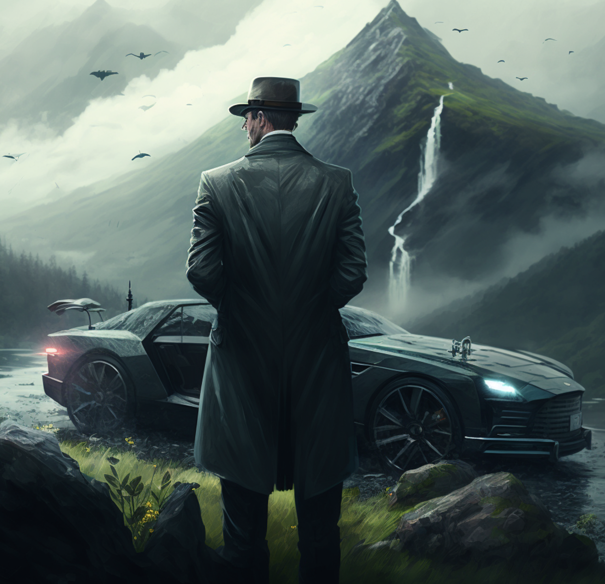

# Mountain Car - Reinforcement Learning 🤖

Reinforcement learning (RL) is the part of machine learning that deals with learning from interacting with an environment. In this report, we apply various methods of reinforcement learning to a controlled environment in OpenAI Gym. Let's dive in! 🌊

## 📖 Table of Contents 

- [Introduction to Reinforcement Learning](#scrollTo=meNIE_oRe5-E&uniqifier=18)
- [Open AI GYM](#scrollTo=JMasf3UHtslf&uniqifier=18)
- [Mountain Car Problem 🚗🏔️](#scrollTo=Nmmv5gAzgKYJ&uniqifier=18)
  - [Problem Description](#scrollTo=_JcYQOaxu7qZ&uniqifier=18)
  - [Components](#scrollTo=_JcYQOaxu7qZ&uniqifier=18)
  - [Objective](#scrollTo=_JcYQOaxu7qZ&uniqifier=18)
  - [Environment](#scrollTo=oyQ9SR2QvF5N&uniqifier=18)
    - [Environment Setup](#scrollTo=fdL_nhpSvF5V&uniqifier=18)
    - [Trajectory Analysis](#scrollTo=-3hLqxsP2_CP&uniqifier=18)
- [Mountain Car Algorithms: Traditional](#scrollTo=ay75JFPetwA5&uniqifier=18)
  - [Cross Entropy Method](#scrollTo=KXHf0DfNvwSU&uniqifier=18)
- [Q-Table Optimization](#scrollTo=06GPgybBhud4&uniqifier=18)
  - [Theory](#scrollTo=VSQuHMUwHfHR&uniqifier=18)
  - [Random Q-learning](#scrollTo=ZF4zxZltM46q&uniqifier=18)
  - [Table based Q-learning](#scrollTo=utkO8dflAEK2&uniqifier=18)
  - [Double Q-learning](#scrollTo=Nwv-tGn9Cz9F&uniqifier=18)
  - [SARSA](#scrollTo=DEbnpVBA-ime&uniqifier=18)
  - [Conclusion of Q-Table optimization](#scrollTo=LESDxM_c5SW6&uniqifier=18)
- [Deep Q-Learning Set up](#scrollTo=LvV5w0FLiBHj&uniqifier=18)
  - [Libraries](#scrollTo=YdIX4Hs-uWVJ&uniqifier=18)
  - [Directories](#scrollTo=VXfwMneVu5AF&uniqifier=18)
  - [Environment](#scrollTo=LNK51b6TYqhs&uniqifier=18)
    - [Experience Replay Memory](#scrollTo=CBOzjni2v-vn&uniqifier=18)
    - [Network](#scrollTo=fnNKxH4yw66J&uniqifier=18)
      - [DQN - Multilayer Perceptron (MLP)](#scrollTo=o-Pn1ds7dmU6&uniqifier=18)
      - [DQN - Multilayer Perceptron (MLP) with Dropout Layers](#scrollTo=V4BGcfjvKf2m&uniqifier=18)
  - [Action Selection (Epsilon-Greedy Algorithm)](#scrollTo=YEJXx4tyxY83&uniqifier=18)
  - [Training Loop](#scrollTo=6W2NjEG5017z&uniqifier=18)
  - [Plot Function](#scrollTo=advwHE272vBE&uniqifier=18)
  - [Training](#scrollTo=S0SGSW97ZamC&uniqifier=18)
    - [Hyperparameters](#scrollTo=dKc8hxRy6gM8&uniqifier=18)
    - [Model Initialization](#scrollTo=Uabw7s6V72_I&uniqifier=18)
    - [Training](#scrollTo=fz5tgti39qZ1&uniqifier=18)
- [DQN with Dropout](#scrollTo=3QQh1mL5tQrA&uniqifier=18)
- [DQN Normal](#scrollTo=AhmQ7LiiOK8I&uniqifier=18)
- [Double DQN (DDQN)](#scrollTo=qC7ZzJgoXTOc&uniqifier=18)
- [Noise network](#scrollTo=Fal1HNYyO0kg&uniqifier=18)
- [Comparison DQNs](#scrollTo=1Wk4EjKhkKdl&uniqifier=18)
- [DQN vs Double Q Learning](#scrollTo=nNFNZNN5wG6n&uniqifier=18)
- [🏁 Conclusion](#scrollTo=Crr91Deh3L7l&uniqifier=18)
- [Sources](#scrollTo=6k_778s1rIBJ&uniqifier=18)

## Introduction

**OpenAI Gym** is a Python package comprising various **RL (Reinforcement Learning) environments**, including:

- 🧸 **Simple “Toy” Environments**: Simpler environments to help you start.
- 🤺 **Challenging Environments**: 
  - 🤖 **Simulated Robotics**: Emulating robotic tasks and challenges.
  - 🕹️ **Atari Video Games**: Train agents in environments simulating classic Atari video games.

OpenAI Gym offers different difficulty levels and complexities suitable for a range of RL tasks.

### Mountain Car Problem 🚗🏔️

#### Problem Description

- **Context**: A car between two “mountains”. The objective is to drive up the mountain on the right, but the car's engine isn't powerful enough in a single pass.
- **Challenge**: To oscillate and gain momentum.

This problem aptly suits reinforcement learning since it's a simple representation of real-world challenges.

#### Components

- **Agent**: The car 🚗.
- **Environment**: World with mountains 🏔️.
- **Action**: Move ➡️ right, ⬅️ left or 🚫.
- **State**: Car's position 📍 and velocity 🚀.
- **Reward**: -1 📉 for each step away from the flag 🏁; maximized when reached flag in minimal steps.

#### Objective

The aim is to maximize total rewards 📈 by reaching the flag 🏁 in the least steps. Read more [here](https://www.gymlibrary.dev/environments/classic_control/mountain_car/).

(Include other sections using similar structure and formatting.)

---

📌 Note: It's essential to maintain consistency in formatting and structure throughout the README for a clean look. The use of emojis adds a touch of vibrancy. However, make sure the file looks clean and clutter-free in GitHub's preview.

